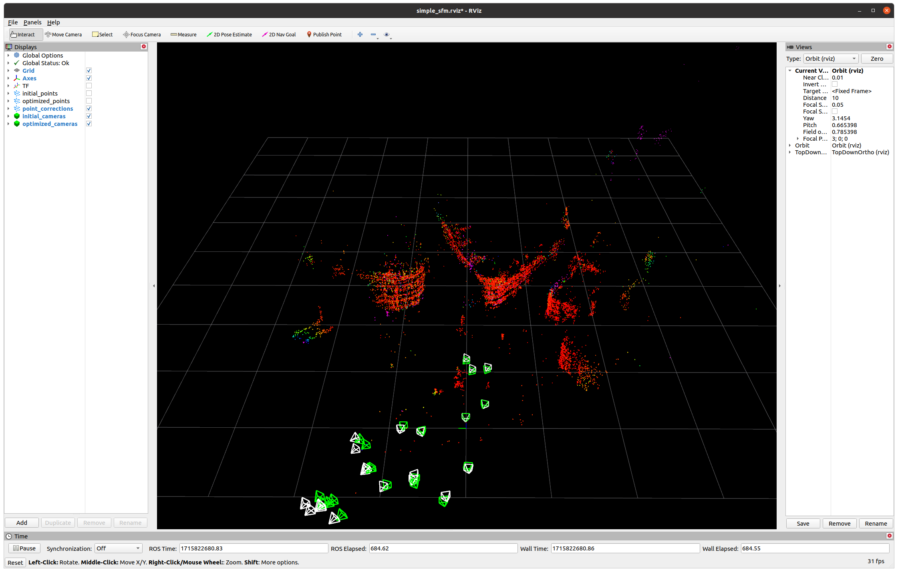

# simple_sfm

This project aims at providing a gentle, but practical introduction to formulating and solving the Structure from Motion (SfM) / Bundle Adjustment problem. The project uses [Bundle Adjustment in Large](https://grail.cs.washington.edu/projects/bal/) as sample dataset. The project is to be used as a learning tool and the target audience is students and researchers who need a practical example to understand the SfM problem and how to solve it using various optimization techniques.

## Dependencies
To run this project, you will need the following dependencies. You can install them manually or use the provided [install_deps.sh](install_deps.sh) script to install them automatically.
- ROS (Tested with ros-noetic-desktop on Ubuntu 20.04): [Installation Instructions](http://wiki.ros.org/noetic/Installation/Ubuntu) (Out of scope for this document)
- pcl-conversions:
  ```sh
  $ sudo apt install ros-noetic-pcl-conversions
  ```
- Conan:
  ```sh
  $ pip3 install conan==1.64.0
  ```

## Quick Start
To get started with this project and run the sample node, follow these steps:
1. Clone the repository:
   ```sh
   $ git clone https://github.com/ameysutavani/simple_sfm.git
   ```
1. Install the dependencies mentioned in the Dependencies section.
1. Build the project:
   ```sh
   $ cd simple_sfm/samples/ros1
   $ catkin_make
   ```
   > **Note:** The first time you run the above command, it will automatically fetch and build the necessary dependencies such as GTSAM and Catch2 using Conan (seamlessly, via the conan.cmake wrapper).

1. Source the workspace:
   ```sh
   $ source devel/setup.bash
   $ # (If you use zsh) source devel/setup.zsh
1. Launch the sample node:
    ```sh
    $ roslaunch simple_sfm simple_sfm.launch launch_rviz:=true
    ```

   The node will read a sample Trafalgar BAL dataset file from the [simple_sfm_ros/data](samples/ros1/src/simple_sfm_ros/data) directory and perform the bundle adjustment optimization using the simple_sfm library. Once the optimization is complete, the node will keep publishing the initial and optimized points and the initial and the optimized camera poses, which should look like the following:

    

    Which should resemble the map view of the Trafalgar Square in London:

    

     The white points and the cameras represent the initial values and the green points and the cameras represent the optimized values. Additionally, you can also enable the `point_corrections` topic in Rviz to visualize the degree to which each point was corrected during the optimization process.

    

    Explore the `simple_sfm.launch` file arguments to customize the behavior of the node.

## Additional useful information
- [Development notes and design considerations](docs/development.md)
- [WIP: Using devcontainer for development](docs/devcontainer.md)

## Future Scope
Some potential areas for future development and improvement include:
- Add a basic CI/CD pipeline to run tests and build the project. (WIP)
- Adding other optimization libraries such as Ceres Solver to demonstrate the usage and flexibility of the library.
- Adding a dataset with griund-truth values to evaluate the performance of the optimization.
